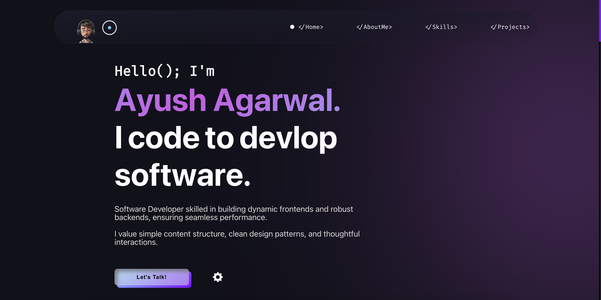

# Ayush’s Portfolio

This repository contains a beautiful, responsive personal portfolio built using React, Vite, and TailwindCSS. The project showcases modern web development techniques including smooth animations, responsive layouts, and interactive UI components.

### Want to watch this?



## Features

- **Modern Design:** Minimal, elegant design with animated transitions and a smooth user experience.
- **Responsive Layout:** Fully responsive design optimized for desktops, tablets, and mobile devices.
- **Interactive UI:** Dynamic components, animated loading screens, and a mobile-friendly hamburger menu.
- **Performance-Oriented:** Powered by Vite for blazing-fast builds and TailwindCSS for highly customizable styling.

## Technologies

- **React:** Component-based JavaScript library for building UIs.
- **Vite:** Lightning-fast development server and build tool.
- **TailwindCSS:** Utility-first CSS framework for rapid styling.
- **JavaScript (ES6+):** Modern JavaScript practices and clean, maintainable code.

## Installation

1. **Clone the repository:**
 
 ```bash

git clone https://github.com/ayushagarwal138/ayush-portfolio.git
cd ayush-portfolio
```

2. **Install dependencies:**
   
```bash
npm install
```


3. **Start the development server:**
   
```bash
npm run dev
```

The application will run at http://localhost:5173.

## Build

To create a production build:

```bash
npm run build
```

To preview the production build:

```bash
npm run preview
```

## Folder Structure

```
ayush-portfolio/
├── public/
│   └── index.html
├── src/
│   ├── components/
│   │   ├── Navbar.jsx
│   │   ├── MobileMenu.jsx
│   │   ├── LoadingScreen.jsx
│   │   └── sections/
│   │       ├── Home.jsx
│   │       ├── About.jsx
│   │       ├── Projects.jsx
│   │       └── Contact.jsx
│   ├── index.css          # Tailwind base and global styles
│   ├── App.jsx
│   └── main.jsx
├── package.json
├── vite.config.js
└── README.md
```

## Customization

- **Styling:** Modify index.css or use Tailwind utility classes in JSX files to personalize the look.
- **Sections:** Update content in `src/components/sections/` to reflect your own biography, projects, and contact details.
- **Components:** Tweak or extend components in `src/components/` for additional functionality or different layout.

## Contributing

Feel free to fork this project and submit pull requests or issues! Contributions are warmly welcome.

## License

This project is open source and available under the MIT License.

⸻

Thanks for checking out my portfolio. Happy coding! 🚀
