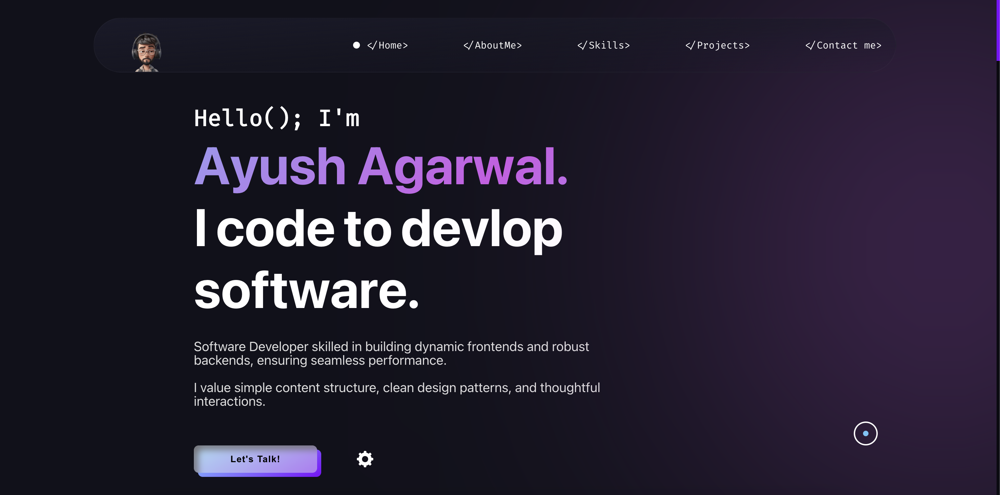

# Ayush’s Portfolio

This repository contains a beautiful, responsive personal portfolio built using React, Vite, and TailwindCSS. The project showcases modern web development techniques including smooth animations, responsive layouts, and interactive UI components.

### Want to watch this?



## Features

- **Modern Design:** Minimal, elegant design with animated transitions and a smooth user experience.
- **Responsive Layout:** Fully responsive design optimized for desktops, tablets, and mobile devices.
- **Interactive UI:** Dynamic components, animated loading screens, and a mobile-friendly hamburger menu.
- **Performance-Oriented:** Powered by Vite for blazing-fast builds and TailwindCSS for highly customizable styling.

- **About Section:** A brief introduction about yourself.
- **Skills:** Highlight technical and non-technical skills.
- **Projects:** Showcase your top projects with descriptions and links.
- **Contact Form:** A form where visitors can reach out to you.
- **Responsive Design:** A Mobile-friendly design.

## Technologies

- **HTML:** For structuring the content of your website.
- **CSS:** For styling and responsive design.
- **JavaScript:** For interactivity and dynamic behavior.

## Installation & Deployment

- Clone the repository and modify the content of index.html according to your requirement.
  
- This portfolio can be easily deployed on Vercel for live hosting. Simply follow these steps:
	1.	Fork or clone the repository.
	2.	Go to Vercel.
	3.	Click on New Project and import this repository.
	4.	Vercel will automatically detect the project settings and deploy it for you.

Once deployed, you’ll have a live version of the portfolio accessible online.

## Tools Used 🛠️
* [<b>GitHub</b>](https://github.com/) - To host my static website (HTML, CSS, JS).
* [<b>Animate on scroll library</b>](https://github.com/michalsnik/aos) - To animate my website while scrolling.
* [<b>Animista</b>](https://animista.net/) - To use Interactive animations

## Folder Structure

```
ayush-portfolio/
├── public/                              # Contains static files that are publicly accessible
│   └── index.html                       # Main HTML file for the portfolio
├── src/                                 # Source code for the project
│   ├── components/                      # Contains reusable components of the portfolio
│       ├── ico                          # Folder for icons used throughout the portfolio
│       ├── logo                         # Folder for logo images
│       ├── mp3                          # Folder for audio files (e.g., background music)
│       ├── pdf                          # Folder for PDF files (e.g., resume, portfolio)
│       ├── projects-img                 # Folder for images related to projects
│       └── svg                          # Folder for SVG files (e.g., vector images)
│── main.js                              # Main JavaScript file that contains the logic and interactivity
│── style.css                            # CSS file for styling the portfolio
│── sitemap.xml                          # Sitemap for SEO optimization
│── LICENSE                              # License file for the project (e.g., MIT License)
└── README.md                            # README file containing project description and setup instructions
```

## Customization

- **Styling:** Modify index.css or use Tailwind utility classes in JSX files to personalize the look.
- **Sections:** Update content in `index.html/` to reflect your own biography, projects, and contact details.
- **Components:** Tweak or extend components in `src/components/` for additional functionality or different layout.

## Contributing

Feel free to fork this project and submit pull requests or issues! Contributions are warmly welcome.

## License

This project is open source and available under the MIT License.

⸻

Thanks for checking out my portfolio. Happy coding! 🚀
